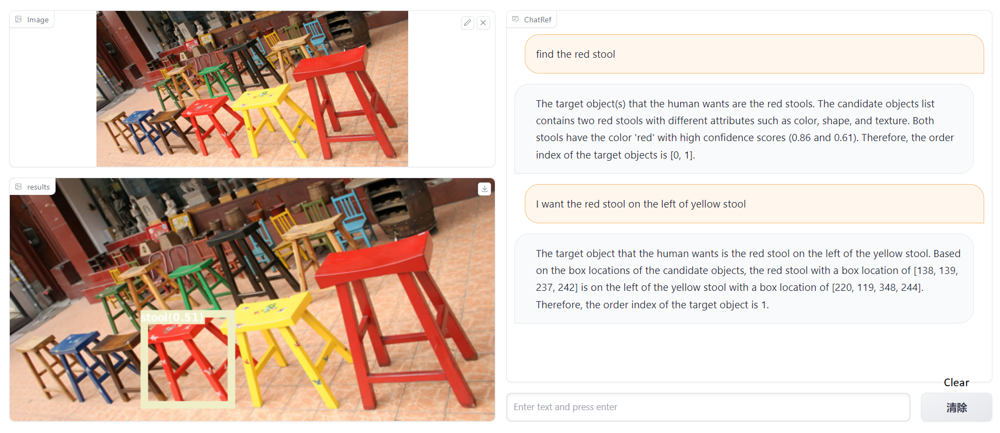

# Language Models can do Zero-Shot Visual Referring Expression Comprehension

## Install
```
conda install pytorch torchvision torchaudio pytorch-cuda=11.8 -c pytorch -c nvidia
pip install -r requirements.txt
pip install git+https://github.com/openai/CLIP.git
```

## Setup 
- OpenAI API key
Create a file named **.env** and write the following line
> OPENAI_API_KEY = "copy from openai website"
- Download detector model checkpoint from [repo](https://github.com/IDEA-Research/GroundingDINO#luggage-checkpoints)
```
wget https://github.com/IDEA-Research/GroundingDINO/releases/download/v0.1.0-alpha/groundingdino_swint_ogc.pth
```
- Download segmentation model checkpoint from [repo](https://github.com/facebookresearch/segment-anything)
```
wget https://dl.fbaipublicfiles.com/segment_anything/sam_vit_h_4b8939.pth
```

## Demo
```
python ChatBot.py
```



